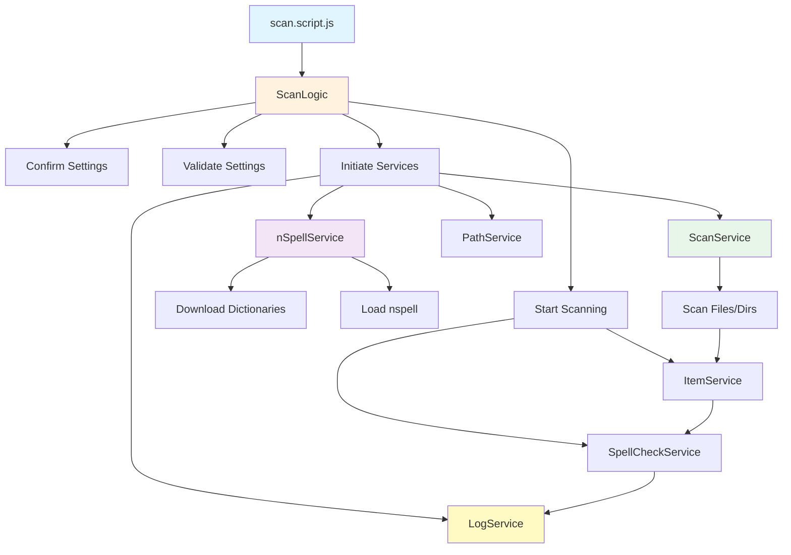
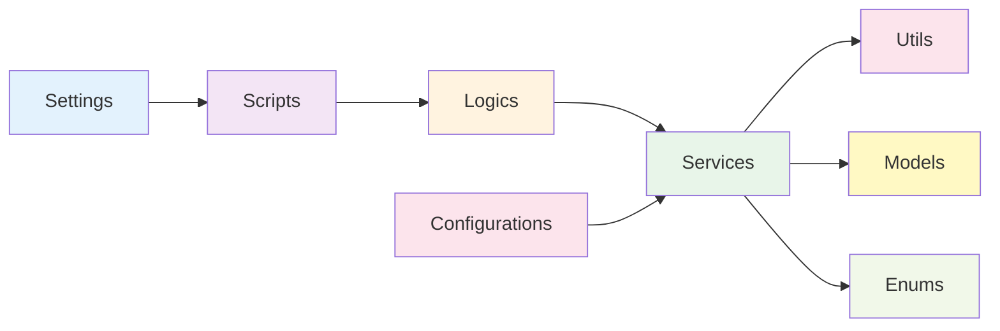

# Files Spell Checker

A Node.js application to scan file names, directory paths, and file contents for spelling mistakes and generate comprehensive reports. Built to help developers maintain consistent and error-free naming conventions in their projects.

Built in February 2020. Updated in 2024. Thanks to [cspell-dicts](https://github.com/streetsidesoftware/cspell-dicts/tree/master/dictionaries) for the dictionaries.

## Features

- 📁 **Dual Mode Scanning**
  - NAME mode: Scan file and directory names for misspellings
  - CONTENT mode: Scan file contents for misspellings
- 📚 **Dictionary Support**: Automatic download and integration of multiple dictionaries
- 🎯 **Flexible Configuration**: Extensive settings for paths, file types, and ignore patterns
- 📊 **Real-time Progress**: Console status updates with detailed statistics
- 📝 **Comprehensive Logging**: Detailed TXT reports with suggestions for corrections
- ⚡ **Performance Controls**: Configurable delays and limits for large projects
- 🚫 **Smart Filtering**: Ignore specific words, paths, and file types
- ✅ **Interactive Confirmation**: Review settings before starting scan

### Core Capabilities

- **Dual-Mode Scanning**: Supports both file/directory name scanning and file content scanning.
- **Automated Dictionary Management**: Automatically downloads and initializes multi-language dictionaries.
- **Smart Filtering System**: Exclude specific paths, file extensions, and common technical terms.
- **Interactive Validation**: Pre-scan configuration review to ensure accuracy before processing.

### Technical Excellence

- **Modular Architecture**: Separated concerns between scripts, services, and utilities.
- **Robust Error Handling**: Centralized error management for network and file system operations.
- **Performance Optimized**: Implements configurable delays to prevent system resource exhaustion.
- **Clean Code Standards**: Follows consistent naming conventions and functional programming principles.

### Developer Experience

- **Extensible Configuration**: Easily add new dictionaries or ignore patterns via dedicated config files.
- **Real-time Feedback**: Detailed console progress bars and status indicators.
- **Comprehensive Reporting**: Generates structured TXT reports with timestamped versioning.
- **Sandbox Environment**: Dedicated testing scripts for safe feature verification.

## Getting Started

### Prerequisites

- Node.js (v14 or higher)
- npm or pnpm
- Internet connection (for initial dictionary download)

### Installation

1. Clone the repository:

```bash
git clone https://github.com/orassayag/files-spell-checker.git
cd files-spell-checker
```

2. Install dependencies:

```bash
npm install
```

3. Configure settings (see Configuration section)

4. Run the application:

```bash
npm start
```

## Configuration

Edit `src/settings/settings.js` to configure the application:

### Essential Settings

```javascript
{
  // Choose scanning method: NAME or CONTENT
  METHOD: MethodEnum.NAME,

  // Choose display mode: STANDARD or SILENT
  MODE: ModeEnum.STANDARD,

  // Set the path to scan
  SCAN_PATH: 'C:\\projects\\my-project',

  // Enable/disable result logging
  IS_LOG_RESULTS: true,

  // Maximum items to scan
  MAXIMUM_ITEMS_COUNT: 100000000
}
```

### Additional Configuration Files

- **File Extensions**: `src/configurations/files/allowFileExtensions.configuration.js`
- **Ignore Paths**: `src/configurations/files/ignorePaths.configuration.js`
- **Ignore Words**: `src/configurations/files/ignoreWords.configuration.js`
- **Ignore Files**: `src/configurations/files/ignoreFiles.configuration.js`
- **Dictionaries**: `src/configurations/files/dictionariesURLs.configuration.js`

See [INSTRUCTIONS.md](INSTRUCTIONS.md) for detailed configuration guide.

## Usage

### Basic Usage

```bash
npm start
```

The application will:

1. Display important settings
2. Ask for confirmation
3. Download dictionaries (first run only)
4. Scan files/directories
5. Generate report in `dist` directory

### Console Output Example

```
===IMPORTANT SETTINGS===
METHOD: NAME
MODE: STANDARD
SCAN_PATH: C:\projects\my-project
========================
OK to run? (y = yes)

===[SETTINGS] Time: 00.00:00:04 | Method: NAME | Ignore Words: 0 | Ignore Paths: 13===
===[GENERAL] Current: 40/250 (16.00%) | Status: SCAN===
===[ITEMS] Total: ✅ 79 | Misspell: ❌ 0 | Skip: 0 | Error: 0===
===[WORDS] Total: 114 | Misspell: 0===
```

### Available Scripts

- `npm start` - Run the spell checker
- `npm run backup` - Create a backup of the project
- `npm run sand` - Run sandbox tests

## Development

- **Workflow**: The application uses a script-based execution model where `scan.script.js` orchestrates services.
- **Environment**: Built with standard Node.js APIs to ensure cross-platform compatibility.
- **Testing**: Includes a sandbox test suite for verifying spell-checking logic in isolation.

## Project Structure



### Directory Structure

```
src/
├── configurations/     # Dictionary URLs and ignore patterns
├── core/               # Enums and core data models
├── scripts/            # Main execution logic (scan, backup, initiate)
├── services/           # Business logic (spell-checking, logging, scanning)
├── settings/           # Global application settings
├── tests/              # Sandbox and integration tests
└── utils/              # Helper functions for file, path, and text operations
```

## Architecture



### Architecture Principles

1. **Separation of Concerns**: Business logic is isolated in services, while orchestration lives in scripts.
2. **Configuration-Driven**: Application behavior is controlled by centralized settings and configuration files.
3. **Stateless Utilities**: Utility functions are pure and independent of application state.
4. **Single Responsibility**: Each service handles a specific domain (e.g., nspell, logging, file system).

### Design Patterns

- **Service Pattern**: Encapsulates logic for specific features like spell checking or log management.
- **Singleton-like Services**: Services are initialized once per execution run.
- **Utility Pattern**: Shared helper functions for cross-cutting concerns.
- **Enum Pattern**: Centralized constants for method and mode selections.

## Output Files

Results are saved to timestamped directories:

```
dist/
  └── 1_20240305_143022/
      └── scan_results.txt
```

Log files include:

- Files/directories with misspellings
- Suggested corrections
- Full path information
- Summary statistics

## Best Practices

- **Path Handling**: Always use absolute paths or properly escaped relative paths in settings.
- **Dictionary Updates**: Periodically check dictionary URLs for availability.
- **Ignore Lists**: Keep ignore lists focused to avoid skipping valid misspellings.
- **Memory Management**: Use the delay settings when scanning large-scale projects.

## Built With

- [Node.js](https://nodejs.org/) - JavaScript runtime
- [nspell](https://github.com/wooorm/nspell) - Spell checker library
- [dictionary-en](https://github.com/wooorm/dictionary-en) - English dictionary
- [fs-extra](https://github.com/jprichardson/node-fs-extra) - File system utilities
- [log-update](https://github.com/sindresorhus/log-update) - Console logging
- [is-reachable](https://github.com/sindresorhus/is-reachable) - Internet connectivity check

## Contributing

Contributions are welcome! Please read [CONTRIBUTING.md](CONTRIBUTING.md) for details on our code of conduct and the process for submitting pull requests.

## Versioning

We use [SemVer](http://semver.org) for versioning. For the versions available, see the [tags on this repository](https://github.com/orassayag/files-spell-checker/tags).

## Author

- **Or Assayag** - _Initial work_ - [orassayag](https://github.com/orassayag)
- Or Assayag <orassayag@gmail.com>
- GitHub: https://github.com/orassayag
- StackOverflow: https://stackoverflow.com/users/4442606/or-assayag?tab=profile
- LinkedIn: https://linkedin.com/in/orassayag

## License

This application has an MIT license - see the [LICENSE](LICENSE) file for details.

## Acknowledgments

- Built for educational and research purposes
- Respects robots.txt and implements rate limiting
- Uses user-agent rotation to avoid detection
- Implements polite crawling practices
